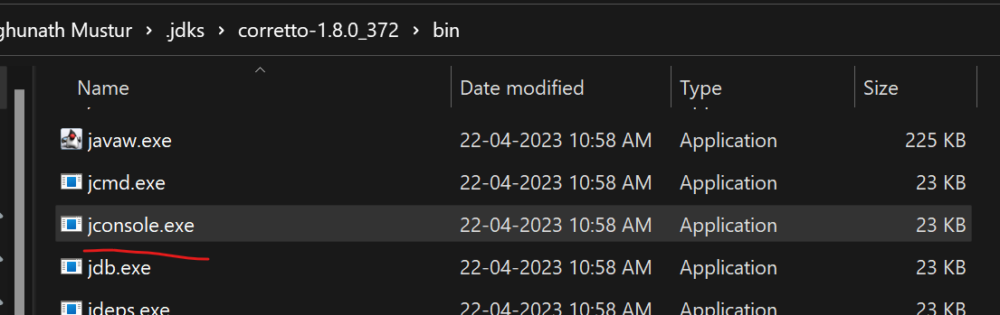
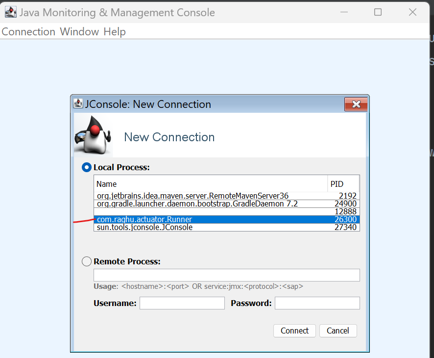
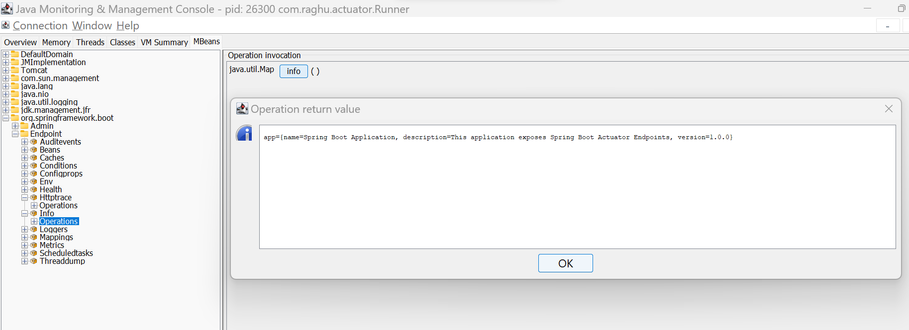
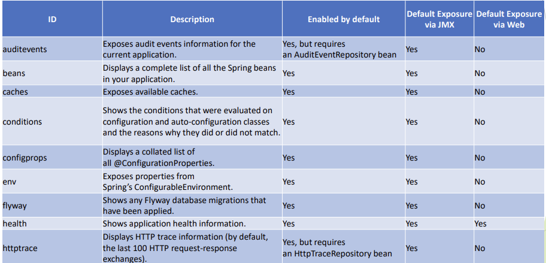
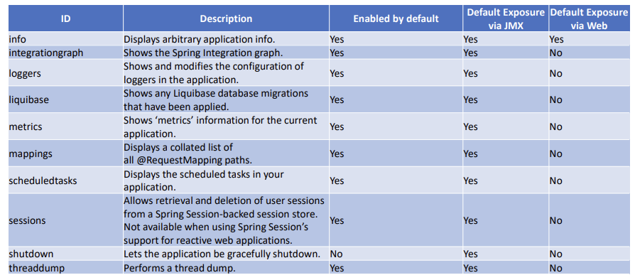

Spring Boot
----------
Errors Faced
------------
1. Java Versions, gradle and dependencies should sync
2. If you are using annotation processor like lombok, MapStruct always declare annotation processor dependencies along with lombok, MapStruct dependencies
   ```
       implementation 'org.springframework.boot:spring-boot-starter-web:2.1.4.RELEASE'
       implementation 'org.springframework.boot:spring-boot-configuration-processor:2.1.14.RELEASE'
       compileOnly group: 'org.projectlombok', name: 'lombok', version: '1.18.6'
       annotationProcessor 'org.projectlombok:lombok:1.18.6'
   ```
What is SpringBoot?
-------------------
1. Spring Boot is a Java Framework that allows you to easily create stand-alone,
   production-grade Spring based Java Applications. It is often used in Microservice
   Architecture because of simplicity that it allows.
2. Applications created with Spring Boot can be executed with simple java –jar
   command and also allows traditional war deployment.
3. Spring Boot supports following embedded containers:
   1. Tomcat
   2. Jetty
   3. Undertow
4. By embedding the web server, Spring Boot simplifies the deployment process. You don't need to separately install and configure an external web server to run your application.
5. Simplicity of deployment and execution has many advantages, for example, it allows
   for Dev/Prod parity (https://12factor.net/) which increases product quality.
   1. The goal is to ensure that the development environment closely resembles the production environment in terms of configuration, dependencies, and infrastructure.
6. Spring Boot provides number of features that can be used to fulfill non-functional
   requirements for the project (externalized configuration, security, metrics, health
   checks).
7. Spring Boot provides many modules under common umbrella:
   1. Spring Boot DevTools – live-reload to speed-up development
   2. Spring Boot Actuator – monitoring and management of application
   3. Spring Boot Starters – dependency set for technologies to minimize setup time
   4. Spring Boot Autoconfiguration – configuration templates for technologies to
      minimize setup time
8. On top of it, you can use all Spring Framework technologies, like:
   1. Spring Web – Spring MVC Framework
   2. Template Engines – server side rendering engines for web pages
   3. Spring Security – authentication and authorization framework
   4. Spring Data MongoDB – NoSQL database client
   5. ... and many more
9. advantages of using Spring Boot
   1. Maximizes productivity
      1. by reducing the setup times through starter dependencies
   2. Simplifies deployment, by allowing to create executable jar, and also supports
      traditional deployment on top of application server
      1. by providing embedded servers
   3. Provides automatic configuration which reduces boilerplate configuration, and
      allows easy customization when defaults are not sufficient
      1. Like autoconfiguration of embedded databases, template engines, mvc view resolving 
   4. Allows for Dev/Prod Parity
   5. Provides set of managed dependencies
   6. Provides Maven Plugins
   7. Provides non-functional features common for projects - externalized
      configuration, security, metrics, health checks
   8. Integrates with Micro Service Architecture Tools for building Highly Available and
      Fault Tolerant Applications – Eureka, Ribbon, OpenFeign
   9. Integrates with systemd and init.d, which allows to easily run applications as
      Linux Service
   10. Uses IoC/DI from Spring Framework

SpringBoot is opinionated
------------------------
1. Spring Boot is “opinionated” framework because it comes with general idea on how application should be organized, provides default configurations and modules setups for technology related aspect of application. (embedded databases, mvc view resolvers, template rendering engines, ...)
2. In comparison with Spring Framework, Spring Boot provides starters and autoconfigurations which
   intelligently fits default configuration based on defined dependencies.
3. Main advantage on how Spring Boot approaches “opinionated” style, is that you can always override
   default configuration if it does not fit your use case.
4. “Opinionated” has following advantages:
   1. Simplifies application setup
   2. Maximizes productivity, by allowing you to focus on business code instead of setup of technology related code
   3. Allows you to write configuration only in case when defaults are not a good fit for your case
   4. Allows easy integration with technology modules (Embedded Databases, Containers ...)
   5. Minimizes amount of setup code
5. disadvantage of “opinionated” framework
   1. The main disadvantage of “opinionated” framework is that, if your application does not fall into most use cases supported by framework, you will have to override most of default setup, configurations and project organization, which might harm your productivity.

Things affected on Spring Boot start up
---------------------------------------
1. Spring Boot uses autoconfiguration to detect dependencies on the class path, based
   on detected dependencies, spring beans are configured to allow integration with
   technologies, like JPA, Data Sources, Embedded Databases, Template Rendering
   engines etc
2. Spring Boot searches for META-INF/spring.factories on classpath that should
   contain entry org.springframework.boot.autoconfigure.EnableAutoConfiguration that lists all
   autoconfiguration classes provided by the autoconfiguration module
3. Autoconfiguration class is using @ConditionalOn... annotations to specify under
   which conditions, certain Autoconfiguration should be applied.
4. Spring Boot provides starter modules, which are empty jars with set of dependencies
   specified with correct dependencies versions to allow easy start with the library.
5. Starter module may provide only set of dependencies, or set of dependencies with
   autoconfiguration code.
6. Spring Boot supports following Conditional Annotations for AutoConfiguration classes:
    ConditionalOnBean – presence of Spring Bean
    ConditionalOnMissingBean – absence of Spring Bean
    ConditionalOnClass – presence of class on classpath
    ConditionalOnMissingClass – absence of class on classpath
    ConditionalOnCloudPlatform – if specified cloud platform is active – for
   example Cloud Foundry
    ConditionalOnExpression – if SpEL expression is true
    ConditionalOnJava – presence of Java in specified version
    ConditionalOnJndi – if JNDI location exists
    ConditionalOnWebApplication – if a web application that uses
   WebApplicationContext or StandardServletEnvironment
    ConditionalOnNotWebApplication – application that is not a web application
    ConditionalOnProperty – presence of spring property
    ConditionalOnResource – presence of resource
    ConditionalOnSingleCandidate – only one candidate for the bean found.
7. Example [Link1](CustomAutoConfig) [Link2](CustomConfig)
   ```java
   //disable required classes where auto config is not required
   @Configuration
   @EnableAutoConfiguration(exclude = {DataSourceAutoConfiguration.class})
   public class ApplicationConfiguration {
   }
   
   //add CustomConfig Project As a Dependency
   //implementation group: 'org.example', name: 'CustomConfig',version: '1.0-SNAPSHOT'
   
   //Config for CustomAutoConfig Project
   @Configuration
   @EnableTransactionManagement
   @ConditionalOnClass(name = "org.hsqldb.Database")
   public class DataSourceAutoConfiguration {

    @Bean
    public DataSource dataSource() {
        return new EmbeddedDatabaseBuilder()
                .generateUniqueName(true)
                .build();
    }
   }
   @Configuration
   @ConditionalOnClass(name = "org.hsqldb.Database")
   @EnableJpaRepositories(basePackages = {"com.spring.professional.exam.tutorial.module04.question04"})
   public class JpaAutoConfiguration {
   @Bean
   @Autowired
   public LocalContainerEntityManagerFactoryBean entityManagerFactory(DataSource dataSource) {
   LocalContainerEntityManagerFactoryBean em = new LocalContainerEntityManagerFactoryBean();
   em.setDataSource(dataSource);
   em.setPackagesToScan("com.spring.professional.exam.tutorial.module04.question04");

        HibernateJpaVendorAdapter vendorAdapter = new HibernateJpaVendorAdapter();
        vendorAdapter.setGenerateDdl(true);

        em.setJpaVendorAdapter(vendorAdapter);

        return em;
    }

    @Bean
    public PlatformTransactionManager transactionManager(EntityManagerFactory emf) {
        JpaTransactionManager transactionManager = new JpaTransactionManager();
        transactionManager.setEntityManagerFactory(emf);

        return transactionManager;
    }
   }
   
   //resources/META-INF/spring.factories - declare the path to custom auto config classes
   # Auto Configure
   org.springframework.boot.autoconfigure.EnableAutoConfiguration=\
   com.spring.professional.exam.tutorial.module04.question04.my.autoconfiguration.DataSourceAutoConfiguration,\
    com.spring.professional.exam.tutorial.module04.question04.my.autoconfiguration.JpaAutoConfiguration
    ```

Spring Boot starter POM
-------------------------
1. Spring Starter POM is a maven module that represents empty jar with set of
   dependencies required to work with specified technology. Spring Starter may also
   provide autoconfiguration to create beans required to integrate project with
   technologies that you intend to use.
2. Spring Starters are useful, because they simplify project setup by assuring that
   all dependencies in correct versions are set. If Starter provides autoconfiguration
   as well, it integrates technology with Spring Framework.
3. This allows you to focus on business code instead of having to spend time on
   identifying which dependency set is required and which versions are correct.
   Autoconfiguration allows you to use technology within Spring Framework without
   having to integrate technology with it manually
4. Example
   1. First, let's look at developing the REST service; we can use libraries like Spring MVC, Tomcat and Jackson – a lot of dependencies for a single application.Spring Boot starters can help to reduce the number of manually added dependencies just by adding one dependency.
   ```
     <dependency>
      <groupId>org.springframework.boot</groupId>
      <artifactId>spring-boot-starter-web</artifactId>
     </dependency>

     ```

properties and YML files - Externalizing Configuration
------------------------
1. Spring Boot allows you to externalize configuration for the application by using
   properties stored in properties files that can be in format:
   1. YAML
   2. Java Properties File
2. YAML is a superset of JSON and it is convenience for specifying hierarchical data.
   Spring Boot supports YAML properties with usage of SnakeYAML library, which is
   included by default by spring-boot-starter.
   
3. Example
   ```java
      //@EnableConfigurationProperties  -- set config class to map properties
      @SpringBootApplication
      @EnableConfigurationProperties(ApplicationConfiguration.class)
      public class SpringBootConsoleApplication implements CommandLineRunner {

      @Autowired
      private ApplicationConfiguration applicationConfiguration;

       }
   
   //@ConfigurationProperties -- set prefix and define mapping class
   @ConfigurationProperties(prefix = "app")
   @Getter
   @Setter
   @ToString
   public class ApplicationConfiguration {
    private String name;
    private String description;
    private List<String> servers;
    private Map<String, EnvironmentConfiguration> environments;
   }
   
   @Getter
   @Setter
   @ToString
   public class EnvironmentConfiguration {
      private String name;
      private String url;
   }
   ```
   ```
   //application.properties
   app.name=spring-boot-app
   app.description=Example Spring Boot Application
   app.servers[0]=server1
   app.servers[1]=server2
   app.servers[2]=server3
   app.environments['dev'].name=Development Environment
   app.environments['dev'].url=https://dev.example.com
   app.environments['prod'].name=Prod Environment
   app.environments['prod'].url=https://prod.example.com
   
   //or application.yaml
   app:
   name: spring-boot-app
   description: Example Spring Boot Application

   servers:
   - server1
   - server2
   - server3

   environments:
   dev:
   name: Development Environment
   url: https://dev.example.com

    prod:
      name: Prod Environment
      url: https://prod.example.com

   ```


Controlling logging with Spring Boot
---------------
1. Spring Boot allows you to configure following aspects of logging:
   1. Logging Levels
   2. Logging Pattern
   3. Logging Colors
   4. Logging Output – console, file
   5. Logging Rotation
   6. Logging Groups
   7. Logging System used
      1. Logback – default
      2. log4j2
      3.  JDK (Java Util Logging)
   8. Logging System specific configuration:
      1. Logback – logback-spring.xml
      2. log4j2 - log4j2-spring.xml
      3. JDK (Java Util Logging) - logging.properties
2. Logging Levels can be set via application.properties:
   1. logging.level.root=WARN
   2. app.service.a.level=ALL
   3. app.service.b.level=FINEST
   4. app.service.c.level=FINER 
   5. or by using logging system specific configuration, logback-spring.xml example:
      1. <logger name="app.service.a" level="INFO"/>
3. You can also use ––debug or ––trace argument when launching spring boot application:
   1. $ java -jar myapp.jar ––debug
4. It is also possible to specify debug=true or trace=true in
      application.properties.
5. Logging patterns can be set via application.properties:
   ```
   logging.pattern.console=%clr(%d{yy-MM-dd E HH:mm:ss.SSS}) \
   {blue} %clr(%-5p) %clr(${PID}){faint} \
   %clr(---){faint} %clr([%8.15t]){cyan} \
   %clr(%-40.40logger{0}){blue} \
   %clr(:){red} %clr(%m){faint}%n

   ```
6. or by using logging system specific configuration, logback-spring.xml example:
   ```xml
   <appender name="CONSOLE" class="ch.qos.logback.core.ConsoleAppender">
    <encoder>
      <pattern>%d{yyyy-MM-dd} | %d{HH:mm:ss.SSS} | %thread | %5p | %logger{25} | %12(ID: %8mdc{id}) | %m%n</pattern>
      <charset>utf8</charset>
    </encoder>
   </appender>
   ```
   
7. Spring Boot allows you to control logs rotation by specifying maximum file size and
   maximum number of logs file to keep in history.
8. To achieve this behavior through application.properties, you need to set
   following properties:
   1. logging.file.max-size
   2. logging.file.max-history
9. You can also configure logging system specific settings, for example in logbackspring.xml you can configure rolling appender:
   ```xml
   <rollingPolicy class="ch.qos.logback.core.rolling.SizeAndTimeBasedRollingPolicy">
   <fileNamePattern>
     ${LOG_PATH}/archived/log_%d{dd-MM-yyyy}_%i.log
   </fileNamePattern>
   <maxFileSize>10MB</maxFileSize>
    <maxHistory>10</maxHistory>
    <totalSizeCap>100MB</totalSizeCap>
   </rollingPolicy>

   ```
10. Spring Boot can group loggers into group, which simplifies log management.
    1. You can do this on application.properties level in following way:
       logging.group.service-d-and-e=app.service.d, app.service.e
       logging.level.service-d-and-e=DEBUG
11. Spring Boot allows you to chose between logging subsystem
    1. To use default Logback, you just need to use spring-boot-starter
       dependency, autoconfiguration will setup all required beans:
       ```xml
            <dependencies>
            <dependency>
            <groupId>org.springframework.boot</groupId>
            <artifactId>spring-boot-starter</artifactId>
            </dependency>
            </dependencies>
       ```
       
12. Spring Boot allows you to chose between logging subsystem.
    1. To use log4j2, you just need to exclude spring-boot-starter-logging and add dependency to
       log4j2:
       ```xml
       <dependencies>
        <dependency>
         <groupId>org.springframework.boot</groupId>
         <artifactId>spring-boot-starter</artifactId>
         <exclusions>
         <exclusion>
          <groupId>org.springframework.boot</groupId>
          <artifactId>spring-boot-starter-logging</artifactId>
         </exclusion>
        </exclusions>
        </dependency>
        <dependency>
         <groupId>org.springframework.boot</groupId>
         <artifactId>spring-boot-starter-log4j2</artifactId>
        </dependency>
       </dependencies>

       ```
13. Example
    [Link](LoggingSpringBoot)


Discovery of property files by Spring Boot 
-------------------------
1. Profile Specific:
   1. Outside of Jar:
      1. application-{profile}.properties and application-{profile}.yml outside of jar in
         /config subdirectory
      2. application-{profile}.properties and application-{profile}.yml outside of jar in
         current directory
   2. Inside Jar:
      1. application-{profile}.properties and application-{profile}.yml inside of jar in /config
         package on classpath
      2. application-{profile}.properties and application-{profile}.yml inside of jar in
         classpath root package
2. Application Specific:
   1. Outside of Jar:
      1. application.properties and application.yml outside of jar in /config subdirectory
      2. application.properties and application.yml outside of jar in current directory
   2. inside a jar
      1. application.properties and application.yml inside of jar in /config package on classpath
      2. application.properties and application.yml inside of jar in classpath root package
3. Example
   
4. Note -   launch with --spring.profiles.active=dev and working directory pointing to work-dir
   
5. [Repo Link](ReadingPropertiesFiles)

Defining profile specific property files
---------
1. Spring Boot allows you to define profile specific property files in two ways:
   1. Dedicated property file per profile:
      1. application-{profile}.properties
      2. application-{profile}.yml
   2. You can also use application-default.properties or application-default.yml filename to
      specify property file that should be used when no profile is set
   
2. Multi-profile YAML Document
   ```yaml
    server:
      url: https://local.service.com/
    ---
    spring:
      profiles: dev
    server:
      url: https://dev.service.com/
      ---
    spring:
      profiles: prod
    server:
      url: https://prod.service.com/

    ```

Accessing the properties defined in the property files  
--------------------
1. Spring Boot allows you to access properties defined in property files in following ways:
   1. `@Value("${PROPERTY_NAME}")`
      1. You can inject properties into fields with usage of @Value annotation:
         ```
             @Value("${app.propertyB}")
             private String propertyB;
         ```
   2. `@ConfigurationProperties`
      1. You can define Data Object which will hold properties for defined prefix, you also need to
         register Configuration Properties Data Object with usage of EnableConfigurationProperties:
         ```java
            @ConfigurationProperties(prefix = "app")
            @Getter
            @Setter
            public class AppConfiguration {
            private String propertyA;
            }
         ```
   3. `Environment` Property Resolver
      1. Inject and use Environment object.
      ```
         @Autowired
         private Environment environment;
         environment.getProperty("app.propertyC")
        ```
   4. Example Properties
      ```properties
      app.propertyA=valueA
      app.propertyB=valueB
      app.propertyC=valueC
      ```
properties - to configure external MySQL
   ------
1. To configure external MySQL in Spring Boot you need to specify URL, Username and Password for
   Data Source by defining following properties:
   ```properties
   spring.datasource.url=jdbc:mysql://localhost:3306/spring-tutorial
   spring.datasource.username=spring-tutorial
   spring.datasource.password=spring-tutorial

     ```
2. Optionally, you can also explicitly specify JDBC Driver:
   1. `spring.datasource.driver-class-name=com.mysql.cj.jdbc.Driver`
3. To initialize Database during application startup via data.sql and schema.sql you also need to
   specify property:
   `spring.datasource.initialization-mode=always`
4. specify connector dependency:
   ```xml
      <dependency>
       <groupId>mysql</groupId>
       <artifactId>mysql-connector-java</artifactId>
      </dependency>
   ```
5. You will also need a way to access database, simplest approach is to use JDBC:
   ```xml
   <dependency>
    <groupId>org.springframework.boot</groupId>
    <artifactId>spring-boot-starter-data-jdbc</artifactId>
   </dependency>
    ```
6. [SourceCode](ConnectingToMySQ;)

Configuration of  default schema and initial data:
------------------------
1. Spring Boot uses following scripts to configure default schema and initial data:
   1. `schema.sql` – contains DDL for db objects creation
   2. `data.sql` – contains data that should be inserted upon db initialization
2. Spring Boot will also load:
   1. `schema-${platform}.sql`
   2. `data-${platform}.sql`
   3. platform is the value of` spring.datasource.platform` property, this allows you to switch
      between database vendor specific scripts, for example platform may be mysql,
      postgressql, oracle etc.
3. Spring Boot will automatically initialize only embedded databases, if you want to initialize
   regular database as well, you need to set property
   `spring.datasource.initialization-mode` to always.
4. If you would like to change default schema.sql and data.sql script names, you can use
   spring.datasource.schema and spring.datasource.data properties to achieve this.
5. Example [Source Link](ConfiguringProperties)
   
Fat Jar
--------
1. Fat jar, also called “executable jar”, is a jar that contains compiled code for your application and
   also all dependencies. Spring Boot uses nested jars approach, that means that fat jar contains all
   dependencies as nested jars. This differs from other approach, which is uber jar that packs all
   dependencies into single jar archive. Uber jar approach is problematic because it is hard to see
   application dependencies and also causes issues when same filename in the same context is used in
   different jars.
2. Fat jar is often called “executable jar” because Spring Boot will generate MANIFEST.MF file which
   contains Main-Class and Start-Class entries together with JarLauncher code. This manifest
   together with launcher code will be used to execute standalone jar.
3. To create fat jar in your project, you need to use plugin `id 'org.springframework.boot'`.
   Executing application is as simple as executing one command:
   1. `java -jar spring-boot-application-1.0-SNAPSHOT.jar`
4. The differences in comparison to original jar are following:
   1. Original jar does not contain all dependencies
   2. Original jar is not executable by default
5. Fat JAR
   
6. Normal Jar
   
7. Example [Source Link](fatJar) -- Execute fatJar Goal to generate fat jar

Difference between an embedded container and a WAR
-----------------------------------------------
1. WAR (Web Application Archive) is a file that represents web module. WAR cannot be executed
   in standalone mode, it needs to be deployed to Application Server like Tomcat or WildFly.
2. Embedded container is used to execute executables jars. Embedded container is packed as
   dependency in executable jar and will be responsible for executing only single application.
   WAR approach on the other hand uses Application Server which might be used to execute
   multiple applications at the same time.
3. Structure 
   
4. To create WAR file with Spring Boot, you need to:
   1. Specify WAR packaging method:
      ```groovy
      war {
      // You can customize the WAR file name if needed
      // archiveFileName = 'your-custom-name.war'
      }

        ```
   2. Specify required dependencies:
      ```xml
      <dependencies>
       <dependency>
         <groupId>org.springframework.boot</groupId>
         <artifactId>spring-boot-starter-web</artifactId>
       </dependency>
       <dependency>
         <groupId>org.springframework.boot</groupId>
         <artifactId>spring-boot-starter-tomcat</artifactId>
         <scope>provided</scope>
       </dependency>
      </dependencies>

       ```
   3. Use WAR plugin (explicit specification of this plugin is optional):
      ```xml
      <build>
      <plugins>
       <plugin>
         <groupId>org.apache.maven.plugins</groupId>
         <artifactId>maven-war-plugin</artifactId>
         <version>3.2.3</version>
       </plugin>
      </plugins>
      </build>

      ```
   
5. To create Executable JAR file with embedded container in Spring Boot, you need to:
   1. Specify required dependencies:
      ```xml
      <dependencies>
       <dependency>
            <groupId>org.springframework.boot</groupId>
            <artifactId>spring-boot-starter-web</artifactId>
       </dependency>
      </dependencies>
      ```
   2. Use Spring Boot Maven plugin:
   ```xml
   <build>
    <plugins>
     <plugin>
      <groupId>org.springframework.boot</groupId>
      <artifactId>spring-boot-maven-plugin</artifactId>
      <executions>
       <execution>
         <goals>
           <goal>repackage</goal>
         </goals>
       </execution>
       </executions>
       </plugin>
    </plugins>
    </build>
   
   ```

 Embedded containers Supported by Spring Boot 
---------------------
1. Spring Boot supports following embedded containers:
   1. Tomcat
   2. Jetty
   3. Undertow
2. Tomcat is used as default embedded container, it will be automatically included when
   application is using `spring-boot-starter-web`
   ```xml
   <dependencies>
        <dependency>
            <groupId>org.springframework.boot</groupId>
            <artifactId>spring-boot-starter-web</artifactId>
        </dependency>
    </dependencies>

    <build>
        <plugins>
            <plugin>
                <groupId>org.springframework.boot</groupId>
                <artifactId>spring-boot-maven-plugin</artifactId>
                <executions>
                    <execution>
                        <goals>
                            <goal>repackage</goal>
                        </goals>
                    </execution>
                </executions>
            </plugin>
        </plugins>
    </build>
   ```
3. To use Jetty Embedded Container, you need to exclude spring-boot-starter-tomcat and
   include spring-boot-starter-jetty:
   ```xml
      <dependencies>
        <dependency>
            <groupId>org.springframework.boot</groupId>
            <artifactId>spring-boot-starter-web</artifactId>
            <exclusions>
                <exclusion>
                    <groupId>org.springframework.boot</groupId>
                    <artifactId>spring-boot-starter-tomcat</artifactId>
                </exclusion>
            </exclusions>
        </dependency>
        <dependency>
            <groupId>org.springframework.boot</groupId>
            <artifactId>spring-boot-starter-jetty</artifactId>
        </dependency>
    </dependencies>

    <build>
        <plugins>
            <plugin>
                <groupId>org.springframework.boot</groupId>
                <artifactId>spring-boot-maven-plugin</artifactId>
                <executions>
                    <execution>
                        <goals>
                            <goal>repackage</goal>
                        </goals>
                    </execution>
                </executions>
            </plugin>
        </plugins>
     </build>
     ```
   
4. To use Undertow Embedded Container, you need to exclude spring-boot-starter-tomcat
   and include spring-boot-starter-undertow:
   ```xml
   <dependencies>
        <dependency>
            <groupId>org.springframework.boot</groupId>
            <artifactId>spring-boot-starter-web</artifactId>
            <exclusions>
                <exclusion>
                    <groupId>org.springframework.boot</groupId>
                    <artifactId>spring-boot-starter-tomcat</artifactId>
                </exclusion>
            </exclusions>
        </dependency>
        <dependency>
            <groupId>org.springframework.boot</groupId>
            <artifactId>spring-boot-starter-undertow</artifactId>
        </dependency>
    </dependencies>

    <build>
        <plugins>
            <plugin>
                <groupId>org.springframework.boot</groupId>
                <artifactId>spring-boot-maven-plugin</artifactId>
                <executions>
                    <execution>
                        <goals>
                            <goal>repackage</goal>
                        </goals>
                    </execution>
                </executions>
            </plugin>
        </plugins>
    </build>

    ```

How does Spring Boot know what to configure
--------------------------
1. Spring Boot knows what to configure by usage of Auto Configuration Classes defined
   in starter modules. Spring Boot searches for META-INF/spring.factories on
   classpath, whenever entry org.springframework.boot.autoconfigure.EnableAutoConfiguration is
   encountered in this file, Auto Configuration Class pointed by this property is loaded.
2. Auto Configuration class is a regular @Configuration class annotated with
   @ConditionalOn... annotation which specifies under which conditions
   @Configuration class should be loaded.
3. When conditions from @ConditionalOn... annotation are matched,
   @Configuration class is loaded which provides beans that integrates your
   application with specified technology
4. Auto Configuration is often used with starter modules. Starter module provides set
   of dependencies, and optionally may provide Auto Configuration classes.
5. Spring Boot supports following Conditional Annotations for AutoConfiguration classes:
    ConditionalOnBean – presence of Spring Bean
    ConditionalOnMissingBean – absence of Spring Bean
    ConditionalOnClass – presence of class on classpath
    ConditionalOnMissingClass – absence of class on classpath
    ConditionalOnCloudPlatform – if specified cloud platform is active – for
   example Cloud Foundry
    ConditionalOnExpression – if SpEL expression is true
    ConditionalOnJava – presence of Java in specified version
    ConditionalOnJndi – if JNDI location exists
    ConditionalOnWebApplication – if a web application that uses
   WebApplicationContext or StandardServletEnvironment
    ConditionalOnNotWebApplication – application that is not a web application
    ConditionalOnProperty – presence of spring property
    ConditionalOnResource – presence of resource
    ConditionalOnSingleCandidate – only one candidate for the bean found

@EnableAutoConfiguration
----------------------
1. @EnableAutoConfiguration annotation turns on auto-configuration of Spring
   Context. Auto-configuration tries to guess Spring Beans that should be created for
   your application based on configured dependencies and configurations with
   `@ConditionalOn`... annotations.
2. When auto-configuration is turned on, Spring will search for` META-INF/spring.factories`
   on classpath, whenever entry
  ` org.springframework.boot.autoconfigure.EnableAutoConfiguration` is encountered in this file,
   Auto Configuration Class pointed by this property is loaded. When condition present
   in `@ConditionalOn`... annotation is matched, beans pointed out by this
   configuration are created
3. `@EnableAutoConfiguration` annotation should be applied to your application
  ` @Configuration `class, when using Spring Boot with `@SpringBootApplication`
   annotation,` @EnableAutoConfiguration` annotation is not required because
   auto-configuration is turned on by default

@SpringBootApplication 
-----------------------
1. @SpringBootApplication annotation is supposed to be used on top of the class
   and it was introduced for convenience. Usage of` @SpringBootApplication`
   annotation is equivalent to usage of following three annotations:
   1. `@Configuration` – allows additional bean registration
   2. `@EnableAutoConfiguration` – enables context auto-configuration
   3. `@ComponentScan` – turns on scanning for @Component annotated classes

Autoscanning
-------------
1. Spring Boot is performing component scan, because
   @SpringBootApplication annotation is enabling component scanning with
   usage of @ComponentScan annotation.
2. By default, Spring Boot will search for @Component annotated classes within the
   same root package as @SpringBootApplication annotated class.
3. You can change this behavior by adding additional packages to scan with
   scanBasePackages or type-safe version of it scanBasePackageClasses within
   @SpringBootApplication annotation.
   ```java
   @SpringBootApplication(scanBasePackageClasses = {SpringBootConsoleApplication.class, ServiceB.class})
   public class SpringBootConsoleApplication implements CommandLineRunner { 
   }

    ```
   
Auto-Configuration of  DataSource and JdbcTemplate
---------------------
1. DataSource and JdbcTemplate are configured by Auto Configuration Classes
   defined in `spring-boot-autoconfigure` module.
2. DataSource is configured by DataSourceAutoConfiguration, JdbcTemplate
   is configured by JdbcTemplateAutoConfiguration.
   DataSourceAutoConfiguration requires some properties to be defined,
   example below shows MySQL configuration:
   ```properties
   spring.datasource.url=jdbc:mysql://localhost:3306/spring-tutorial
   spring.datasource.username=spring-tutorial
   spring.datasource.password=spring-tutorial
    ```
3. Above properties will be injected into DataSourceProperties by the prefix
   spring.datasource and used by DataSourceAutoConfiguration.
4. After having Auto Configuration enabled by default in Spring Boot, configured
   properties and Database Connector on your classpath, you can just use @Autowire
   to inject DataSource or JdbcTemplate.

Use of spring.factories file
-----------------------
1. spring.factories file, located in` META-INF/spring.factories` location on
   the classpath, is used by Auto Configuration mechanism to locate Auto Configuration
   Classes. Each module that provides Auto Configuration Class needs to have `METAINF/spring.factories` file with `org.springframework.boot.autoconfigure.EnableAutoConfiguration` entry that will point Auto Configuration Classes.
2. `META-INF/spring.factories` file is consumed by SpringFactoriesLoader
   class, which is used by AutoConfigurationImportSelector enabled by
   `@EnableAutoConfiguration` annotation used by default in
   @SpringBootApplication annotation.
3. Each Auto Configuration Class lists conditions, in which it should be applied, usually
   based on existence of specific class on the classpath or bean in the context. When
   conditions are met, @Configuration class produced beans within application
   context to integrate your application with desired technology.
4. Auto Configuration use case for spring.factories file is probably most popular one, it also
   allows you to define other entries and achieve context customization with following classes:
    ApplicationContextInitializer
    ApplicationListener
    AutoConfigurationImportFilter
    AutoConfigurationImportListener
    BeanInfoFactory
    ContextCustomizer
    DefaultTestExecutionListenersPostProcessor
    EnableAutoConfiguration
    EnvironmentPostProcessor
    FailureAnalysisReporter
    FailureAnalyzer
    ManagementContextConfiguration
    PropertySourceLoader
    ProxyDetector
    RepositoryFactorySupport
    SpringApplicationRunListener
    SpringBootExceptionReporter
    TemplateAvailabilityProvider
    TestExecutionListener

Customize Spring auto configuration
-----------------------------
1. You can customize Spring Auto Configuration by creating your own autoconfiguration module with Auto Configuration Class.
2. To do that, you need to create java jar module which will contain METAINF/spring.factories file that contains org.springframework.boot.autoconfigure.EnableAutoConfiguration entry, which points to your Auto Configuration Class.
3. Auto Configuration Class is a class annotated with @Configuration annotation,
   usually used together with @ConditionalOnClass annotation. Additionally you
   can use @PropertySource annotation with
   @EnableConfigurationProperties and @ConfigurationProperties
   annotations to introduce custom properties for your auto-configuration module.
4. Inside Auto Configuration Class you should have @Bean annotated methods, which
   will provide configured beans when @ConditionalOnClass is met.
5. [source](CustomAutoConfig)

@Conditional annotations
---------------------
1. Spring Boot supports following Conditional Annotations for Auto Configuration Classes:
    ConditionalOnBean – presence of Spring Bean
    ConditionalOnMissingBean – absence of Spring Bean
    ConditionalOnClass – presence of class on classpath
    ConditionalOnMissingClass – absence of class on classpath
    ConditionalOnCloudPlatform – if specified cloud platform is active – for
   example Cloud Foundry
    ConditionalOnExpression – if SpEL expression is true
    ConditionalOnJava – presence of Java in specified version
    ConditionalOnJndi – if JNDI location exists
    ConditionalOnWebApplication – if a web application that uses
   WebApplicationContext or StandardServletEnvironment
    ConditionalOnNotWebApplication – application that is not a web application
    ConditionalOnProperty – presence of spring property
    ConditionalOnResource – presence of resource
    ConditionalOnSingleCandidate – only one candidate for the bean found
2. Example
   1. @Conditional annotations are used together with Auto Configuration Classes,
      to indicate under which conditions, specific @Configuration class should
      apply
   ```java
      @Configuration
      @ConditionalOnProperty(name = "file.store", havingValue = "network")
      public class NetworkFileStoreAutoConfiguration {
        @Bean
        public FileStore networkFileStore() {
        return new NetworkFileStore();
        }
      }
    ```


Spring Boot Actuator
-------------------
1. Spring Boot Actuator provides features, that are required for your application to be viewed
   as production ready product, such as:
   1. Monitoring
   2. Health-checks
   3. Metrics
   4. Audit Events
2. Advantage of using Spring Boot Actuator is that you can use those features in your product,
   without having to code them on your own, and enabling it, is as simple as putting
   dependency in your project:
   ```xml
   <dependency>
       <groupId>org.springframework.boot</groupId>
       <artifactId>spring-boot-starter-actuator</artifactId>
   </dependency>
      ```
3. After that you can access endpoints available by default:
   1. /actuator/health
   2. /actuator/info -- read from properties files
4. [Source Code](IntroSpringBootActuator)

Protocols used to access actuator endpoints
---------------------------------------
1. Spring Boot Actuator supports two protocols:
   1. HTTP
   2. JMX
2. HTTP endpoints can be accessed by any HTTP Client, like CURL or Web Browser, by default following are
   enabled:
   1. /actuator/info
   2. /actuator/health
3. JMX allows you to access Actuator MBeans under org.springframework.boot group. You can access
   it with any tool that supports JMX protocol. One of the tool that you can use is JConsole which comes
   with JDK. You can access JMX
   1. 
   2. Locally by PID (enabled by default since Java SE 6)
      
      
   3. Remotely via Socket after enabling it with following Java VM flags (below example setup is simple
      but unsecure, do not use in production):
      ```
      -Dcom.sun.management.jmxremote.local.only=false
      -Dcom.sun.management.jmxremote.port=9010
      -Dcom.sun.management.jmxremote.authenticate=false
      -Dcom.sun.management.jmxremote.ssl=false

      ```

Actuator endpoints that are provided out of the box
----------------------------




Enabling & disabling actuator endpoints
----------------------------------------
1. management.endpoint.${ENDPOINT_NAME}.enabled=true
2. Example
   1. management.endpoint.shutdown.enabled=true
   2. management.endpoint.beans.enabled=false
   3. management.endpoint.info.enabled=false
3. You can also disable ‘Enabled by default’ behavior with usage of property:
   1. management.endpoints.enabled-by-default=false
   2. management.endpoints.enabled-by-default=false
4. You can change endpoints exposure with usage of properties:
   1. management.endpoints.jmx.exposure.exclude
   2. management.endpoints.jmx.exposure.include
   3. management.endpoints.web.exposure.exclude
   4. management.endpoints.web.exposure.include
   5. Example
      1. management.endpoints.web.exposure.include=info, health, env, beans
   6. You can also expose all endpoints with usage of wildcard, for example
      1. management.endpoints.web.exposure.include=*
5. You can enable navigation through Actuator Endpoints, by usage of HATEOAS.
   1. To enable this navigation, all you have to do is to add dependency to your project:
      ```xml
      <dependency>
            <groupId>org.springframework.boot</groupId>
            <artifactId>spring-boot-starter-hateoas</artifactId>
        </dependency>

      ```
6. http://localhost:8080/actuator
7. [Source Code](IntroSpringBootActuator)

Info endpoint - supply data
----------
1. Spring Boot Actuator info endpoint is used to provide arbitrary, non-sensitive,
   custom defined data, available at runtime that can provide additional information
   about started application.
2. info endpoint is exposed by default via protocols:
   1. HTTP at /actuator/info
   2. JMX at org.springframework.boot/Endpoint/Info
   3. info endpoint is usually used to expose information like:
      1. Application Name, Description, Version
      2. Java Runtime Used
      3. Git Information – see git-commit-id-plugin
         1. Branch
         2. Tag
3. You can supply data to Spring Boot by using following methods:
   1. With usage of property files, by defining info.* properties
      ```properties
      info.app.name=Spring Boot Application
      info.app.description=This application exposes Spring Boot Actuator Endpoints
      info.app.version=1.0.0
       ```
   2. By implementing InfoContributor bean
      ```java
      @Component
      public class SystemNameInfoContributor implements InfoContributor {
      @Override
      public void contribute(Info.Builder builder) {
      builder.withDetail("system-name", System.getProperty("os.name"));
      }
      }

       ```
      
4. [Source Code](IntroSpringBootActuator)

Changing logging level of a package using loggers endpoint
-----------------------
1. Spring Actuator allows you to list currently configured loggers with their levels in
   following ways:
   1. via HTTP by visiting /actuator/loggers endpoint
   2. via JMX by executing
      1. org.springframework.boot/Endpoint/Loggers/Operations/loggers
      
2. loggers endpoint is exposed by default via JMX, to use it via HTTP you need to
   expose it by setting following property in application.properties:
   1. `management.endpoints.web.exposure.include=loggers`
3. You can also view logging level for individual logger:
   1. via HTTP by visiting /actuator/loggers/${LOGGER_NAME}, for example:
      /actuator/loggers/com.app.question28
   2. via JMX by executing 
      1. org.springframework.boot/Endpoint/Loggers/Operations/loggerLevels
         with provided name parameter
4. You can change logging level for package by:
   1. curl -i -X POST -H 'Content-Type: application/json' -d '{"configuredLevel": "TRACE"}' \
      http://localhost:8080/actuator/loggers/com.app.question28
   2. JMX via org.springframework.boot/Endpoint/Loggers/Operations/configureLogLevel with
      name and configuredLevel parameters set
5. [Source Code](IntroSpringBootActuator)

Accessing an endpoint using a tag
------------------
1. You access an endpoint using a tag by defining it as part of the request in following way:
   tag=KEY:VALUE.
2. For example
   ```
   /actuator/metrics/http.server.requests?tag=status:200
   /actuator/metrics/jvm.memory.max?tag=area:heap

      ```
3. You can also use multiple tags in one query with usage of & in following way:
   1. tag=KEY1:VALUE1&tag=KEY2:VALUE2
      1. /actuator/metrics/http.server.requests?tag=status:200&tag=method:GET
      2. /actuator/metrics/jvm.memory.max?tag=area:heap&tag=id:G1%20Old%20Gen
4. Tag is used to filter results of query by one or multiple dimensions. It is often used with
   metrics endpoint for data filtering.


Metrics End Point
----------------
1. Spring Actuator provides metrics endpoint which can be used to examine metrics
   collected by the application during runtime
2. metrics endpoint allows you to view information about specific metric by visiting metric
   dedicated URI, for example `/actuator/metrics/process.cpu.usage`
3. metrics endpoint allows you to drill down information further by usage of available tags,
   for example /actuator/metrics/jvm.memory.used?tag=area:heap
4. metrics endpoint allows you to view many out-of-the box defined metrics:
   1. CPU Usage, CPU Core Count
   2. Memory Usage, Max Memory Available
   3. Threads Info
   4. Garbage Collector Statistics
   5. HTTP Requests Info
   6. Embedded Tomcat Related Metrics
   7. many more, also you can define custom metrics
5. metrics endpoint is not exposed via Web by default, to have it available, you need to
   add following entry to application.properties: 
   1. `management.endpoints.web.exposure.include=metrics`


create a custom metric
-------------------
1. Spring Boot Actuator allows you to create custom metrics with usage of
   MeterRegistry from Micrometer Application Metrics Facade.
2. Micrometer used by Spring Boot Actuator allows you to register following Meter
   Primitives that will be exposed via /actuator/metrics endpoint:
    Counter
    Gauge
    Timer
    TimeGauge
    DistributionSummary
    LongTaskTimer
    FunctionCounter
    FunctionTimer
3. Registration of metric can be done via method inside MeterRegistry:
   1. `Counter objectsCount = meterRegistry.counter("storage.object.count", "type", "db");`

4. or via usage of builder:
   ```
   Counter objectsCount = Counter.builder("storage.object.count")
   .tag("type", "db")
   .register(meterRegistry);

    ```
5. Micrometer allows you to expose data with dimensions via tags:
   1. Counter objectsCount = meterRegistry.counter("storage.object.count", "type", "db");
6. or register simple meter without any dimensions:
   1. Counter objectsCount = meterRegistry.counter("storage.object.count"); 

Health Indicator
----------------
1. Health Indicator is a component used by /actuator/health endpoint to check if
   system is in a state which can be used to successfully handle requests.
2. /actuator/health endpoint is returning aggregated information on system status
   by evaluating all Health Indicators registered in HealthIndicatorRegistry.
3. /actuator/health endpoint is exposed by default via both JMX and Web, however
   default configuration is exposing only minimal set of information.
4. This endpoint is used, usually by monitoring software, to periodically check system
   status, upon receiving failed status, automated alert is sent to product support
   team
5. Monitoring endpoint like this, is also very useful when building Highly Available and
   Fault Tolerant Architecture, in this case such endpoint can be used by Load Balancer
   to check which instances are healthy and can accept traffic.
6. To change level of details exposed by /actuator/health endpoint, following
   properties can be used:
   1. management.endpoint.health.show-details
   2. management.endpoint.health.show-components
7. Both of them can support following values:
   1. never – detailed information are never shown (default value)
   2. when-authorized – show information to users with roles from property
      management.endpoint.health.roles
   3. always – detailed information are shown to all users
8. To create custom Health Indicator, Spring Bean has to be created that implements
   HealthIndicator interface:
   ```java
   @Component
   public class CustomHealthIndicator implements HealthIndicator {
   @Override
   public Health health() {
   return Health.up()
   .withDetail("system-ready", true)
   .build();
   }
   }
    ```
9. [Source Code](IntroSpringBootActuator)
10. Spring Actuator provides following Health Indicators that are configured when proper
    dependencies are found:
    1. ApplicationHealthIndicator - Default Implementation, always up.
    2. DiskSpaceHealthIndicator - Checks for low disk space.
    3. DataSourceHealthIndicator - Checks the status of a DataSource and optionally
       runs a test query
    4. CassandraHealthIndicator - Checks that a Cassandra database is up.
    5. CouchbaseHealthIndicator - Checks that a Couchbase cluster is up.
    6. ElasticsearchHealthIndicator - Checks that an Elasticsearch cluster is up.
    7. HazelcastHealthIndicator - Checks that a Hazelcast server is up.
    8. many more
11. Spring Actuator also provides Reactive Health Indicators for reactive applications, like those
    using Spring WebFlux:
    1. CassandraReactiveHealthIndicator - Checks that a Cassandra database is up.
    2. CouchbaseReactiveHealthIndicator - Checks that a Couchbase cluster is up.
    3. MongoReactiveHealthIndicator - Checks that a Mongo database is up.
    4. RedisReactiveHealthIndicator - Checks that a Redis server is up.

Health Indicator status
---------------
1. Health Indicator status is used by Health Indicators to inform Spring
   Actuator if system component checked by them is working correctly or not.
2. Each Health Indicator is expected to return status that represents guarded
   component state, status can be one of following:
   1. UP - component or subsystem is functioning as expected
   2. DOWN - component or subsystem has suffered an unexpected failure
   3. OUT_OF_SERVICE - component or subsystem has been taken out of service and should
      not be used
   4. UNKNOWN - component or subsystem is in an unknown state
   5. Custom Defined
3. Spring Actuator is also using HealthAggregator, especially
   OrderedHealthAggregator to aggregate statuses from all Health Indicators
   and decide on final status. OrderedHealthAggregator is taking statuses from all
   Health Indicators, sorts them by predefined order (DOWN, OUT_OF_SERVICE,
   UP, UNKNOWN), and takes first element after sorting, which represents highest
   priority status and becomes final status of the system.

4. Based on Health Indicator Statuses from above, Spring will also perform default mapping
   of status to HTTP Response Code with usage of HealthStatusHttpMapper that follows
   this default configuration:
   1. UP -> HTTP 200
   2. UNKNOWN -> HTTP 200
   3. DOWN -> HTTP 503
   4. OUT_OF_SERVICE -> HTTP 503
5. You can change default mapping with usage of management.health.status.httpmapping property, for example:
   `management.health.status.http-mapping.DOWN=501`
6. change the Health Indicator status severity order
   1. Spring Actuator allows you to change Health Indicator Status severity order with
      usage of property management.health.status.order for example:
      1.` management.health.status.order=system-halted, DOWN, OUT_OF_SERVICE, UNKNOWN, UP`
   2. This property will be injected into HealthIndicatorProperties and used by
      OrderedHealthAggregator to resolve final status for application by aggregating
      statuses from all Health Indicators available in the system.

3rd-party external monitoring system Integration
------------------------
1. It is a good idea to use external monitoring system, because this way you can use
   monitoring functionalities without having to spend time coding them.
2. External monitoring system usually provides:
   1. Durable persistent storage
   2. Tested way of ingesting massive amount of data
   3. A way to query for data
   4. A way to perform data visualization
   5. Configurable Dashboards
   6. Configurable alerting
3. Spring Actuator uses Micrometer Application Metrics Facade which integrates with
    number of external monitoring systems. Provided dependency management and
    auto-configuration makes it easy to integrate Micrometer into your project.
4. Spring Boot supports following monitoring systems:
    AppOptics
    Atlas
    Datadog
    Dynatrace
    Elastic
    Ganglia
    Graphite
    Humio
    Influx
    JMX
    KairosDB
    New Relic
    Prometheus
    SignalFx
    Simple (in-memory)
    StatsD
    Wavefront
5. Configuring external monitoring system is as easy as adding dependency:
   ```xml
   <dependency>
     <groupId>io.micrometer</groupId>
     <artifactId>micrometer-registry-${monitoring-system-name}</artifactId>
   </dependency>
    ```
6. You might also need to configure some properties, for example:
   `management.metrics.export.elastic.host=http://localhost:9200`


@SpringBootTest 
-------------------
1. You should use `@SpringBootTest` annotation whenever writing `JUnit Integration Test`
   for product that is using Spring Boot.
2. Spring Boot approach to Integration Testing simplifies it by eliminating requirement of
   application deployment or establishing connection to other infrastructure.
3. @SpringBootTest annotation enables Spring Boot specific features on top of Spring
   Test that are useful for testing, like:
   1. Automated Context creation through SpringApplication class
   2. Web Environment for Testing – Mocked or Embedded
   3. Mocked Bean Injection via @MockBean annotation
   4. Spy Injection via @SpyBean annotation
   5. Ability to customize created context with @TestConfiguration annotated classes
   6. Auto configurations for
      1. MVC Testin
      2. JSON Testing
      3. JPA Tests
      4. JDBC Tests
      5. Mongo Db Tests
      6. and much more..
4. To use @SpringBootTest annotation, you will need to add
   @RunWith(SpringRunner.class) annotation on top of your test class first, this
   is required only for JUnit 4,
5. Next you need to use @SpringBootTest annotation:
6. Example
   ```java
   
   @RunWith(SpringRunner.class)
   @SpringBootTest
   @AutoConfigureMockMvc
   public class HelloControllerTest {
   @Autowired
   private MockMvc mockMvc;
   @MockBean
   private NameService nameService;
   @Test
   public void shouldSayHello() throws Exception {
   when(nameService.getName()).thenReturn("Test");
   
         MvcResult mvcResult = mockMvc.perform(MockMvcRequestBuilders.get("/"))
                .andReturn();
      
         assertEquals("Hello Test", mvcResult.getResponse().getContentAsString());
        }
      }
    ```
7. [Soure code](TestingSpringBoot)

@SpringBootTest
---------------
1. @SpringBootTest annotation will auto-configure:
   1. ApplicationContext for testing
   2. Test itself with tools used for testing
2. ApplicationContext is configured by searching for @SpringBootApplication
      or @SpringBootConfiguration annotated classes, based on those bean
      definitions will be created
3. It is also possible to test only slice of the application with usage one of following:
   1. @SpringBootTest#classes
   2. @ContextConfiguration#classes
   3. @AutoConfigure… annotations
      1. @AutoConfigure… annotations allows you to configure specific environment and
         tools for testing, for example @AutoConfigureMockMvc will configure Mock Mvc
         that can be used for Controllers testing.
4. Spring Boot Test includes annotations that are wrapping @AutoConfigure…
   annotations and make test development simpler:
    @JsonTest
    @WebMvcTest
    @WebFluxTest
    @DataJpaTest
    @JdbcTest
    @JooqTest
    @DataMongoTest
    @DataLdapTest
    @RestClientTest and many more
5. [SOURCE CODE](TestingSpringBoot/src/test/java/com/raghu/spingboot/test/controller)

What dependencies does spring-boot-startertest brings to the classpath
-----------
1. spring-boot-starter-test brings following dependencies:
   1. JUnit - Unit Testing for Java Applications
   2. Spring Test - Spring Framework Support for Testing
   3. Spring Boot Test - Utilities and Integration Test Support for Spring Boot
   4. AssertJ - Fluent Assertion Library
   5. Hamcrest - Matchers Library
   6. Mockito - Mocking Framework
   7. JSONassert - JSON Assertion Library
   8. JsonPath - XPath for JSON
   9. XMLUnit - Tools for XML verification

Integration testing with @SpringBootTest for a web application
==============================
1. Integration Test by definition, should check interactions between few components of
   the system (`at least two real, not-mocked components`) to check if those
   components are delivering expected functionalities when working together. In each
   case when writing Integration Test you should decide how many components should
   interact in the test for it to be meaningful. Usually you should decide on smallest
   possible amount of components that are enough to test specific functionality.
   Components that are not meaningful can be omitted, or mocked with usage of
   @MockBean annotation.
2. Web components tests (Controller Tests, Rest Controller Tests), if tested in
   Integration way, should be written in a way for test to make a HTTP Request and
   check HTTP Response. This kind of approach results in meaningful test, which
   delivers feedback that actually checks if component works correctly.
3. Spring Boot allows you to write Integration Tests for Web Components in two ways
   1. MockMvc - [Source code](TestingSpringBoot/src/test/java/com/raghu/spingboot/test/controller/CityControllerMockMvcFullTest.java)
   2. Embedded Container - [Source code](TestingSpringBoot/src/test/java/com/raghu/spingboot/test/controller/CityControllerRestTemplateTest.java)

@WebMvcTest
=========
1. You should use @WebMvcTest annotation when you want to write Integration Test
   that is focused on web layer - controller of your application. @WebMvcTest approach will
   create ApplicationContext that contains only web components - controller classes and omits any
   other components that are not part of web layer(service, dao...etc) . Other components, if required for
   the test, can be mocked with usage of @MockBean annotation or delivered by
   @Configuration annotated class imported with usage of @Import annotation.
   
2. @WebMvcTest supports two cases:
   1. @WebMvcTest supports two cases:
      1. `@WebMvcTest(CityController.class)`
   2. Multiple (All found) Controllers Auto-Configuration – just annotate test with 
      1. `@WebMvcTest`

3. @WebMvcTest annotation will auto-configure:
   1. Mock Mvc
   2. @Controller annotated class
   3. @ControllerAdvice annotated class
   4. @JsonComponent annotated class
   5. @Converter annotated class
   6. @GenericConverter annotated class
   7. @Filter annotated class
   8. @WebMvcConfigurer annotated class
   9. @HandlerMethodArgumentResolver annotated class
4. Example [Source Code](TestingSpringBoot/src/test/java/com/raghu/spingboot/test/controller/CityControllerMockMvcSingleTest.java)


@MockBean vs @Mock
-------
1. @Mock annotation comes from Mockito Framework which allows for easy Mock
   creation. This annotation is used by MockitoJUnitRunner, each field annotated
   with it will have Mock for specified class created. This annotation does not inject
   mocks into tested class on itself, to use injection you need to have target class
   annotated with @InjectMocks annotation
2. @MockBean annotation comes from spring-boot-test, it creates Mockito Mock and
   also injects it into Application Context created by @SpringBootTest. All beans
   which refers to mocked class via @Autowired will get this mock injected instead of
   real class.
3. Main difference between @MockBean and @Mock annotation is that @MockBean
   creates mock and injects it into Application Context, while @Mock annotation only
   creates it, if you want to inject it, you can do it manually or with @InjectMocks
   annotation, however injection is being done to the class not whole Application
   Context.
4. Examples - [Source Code](MockVSMockBean/src/test/java/com/raghu/test/mock)

@DataJpaTest
----------
1. You want to use @DataJpaTest annotation whenever writing an Integration Test for
   JPA related components of your application like Entities or Repositories.
   
2. @DataJpaTest annotation configures:
   1. In-memory embedded database – behavior can be disabled with
      `@AutoConfigureTestDatabase(replace = Replace.NONE)`
   2. Scans and configures @Entity beans
   3. Scans and configures Spring Data Repositories
   4. Configures TestEntityManager
   5. Does not load other components like @Component, @Service, @Controller
      etc.
3. Every @DataJpaTest is transactional by default, after each test transaction is
   rolled back. You can use @Transactional annotation to customize this behavior
4. When using @DataJpaTest you can access TestEntityManager, which contains
   subset of EntityManager methods that are useful for testing
5. Example 
   1. Testing Entity
      1. [Source code](TestingSpringBoot/src/test/java/com/raghu/spingboot/test/controller/EmployeeTest.java) 
   2. Test DAO class
      1. [Source code](TestingSpringBoot/src/test/java/com/raghu/spingboot/test/controller/EmployeeRepositoryTest.java)
